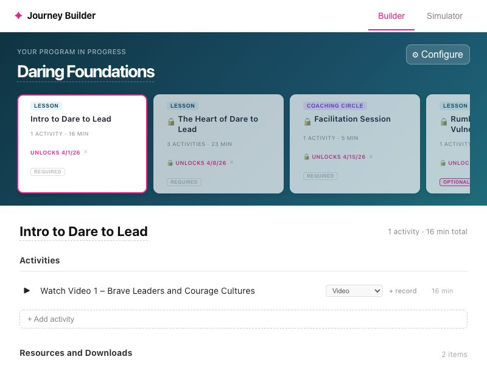

# Member Experience Builder — Review 20260401-172524

*2026-04-01T15:25:24Z by Showboat 0.6.1*
<!-- showboat-id: ad601877-87f6-4fe1-8a61-dc4f793082eb -->

Auto-generated review. Re-run all code blocks with: `showboat verify /Users/alexandrews/Documents/member-experience-builder/scripts/../reviews/review-20260401-172524.md`

## Navigation

```bash
gsd-browser navigate 'http://localhost:5173'
```

```output
Navigated to: http://localhost:5173/
Title: member-experience-builder

Page summary:
Title: member-experience-builder
URL: http://localhost:5173/
Elements: 1 landmarks, 33 buttons, 0 links, 3 inputs
Headings: H1 "Daring Foundations", H2 "Activities", H3 "Resources and Downloads"
```

```bash
gsd-browser wait-for --condition network_idle
```

```output
Wait: network_idle ✓ met (510ms / 10000ms timeout)
```

### Initial page load

```bash
gsd-browser screenshot --output '/Users/alexandrews/Documents/member-experience-builder/scripts/../reviews/screenshots-20260401-172524/01-initial.png'
```

```output
Screenshot saved to /Users/alexandrews/Documents/member-experience-builder/scripts/../reviews/screenshots-20260401-172524/01-initial.png (800x600)
```

```bash {image}
/Users/alexandrews/Documents/member-experience-builder/scripts/../reviews/screenshots-20260401-172524/01-initial.png
```



## DOM Snapshot

```bash
gsd-browser snapshot
```

```output
Snapshot v2: 36 elements
  @v2:e1 button[button] "Builder"
  @v2:e2 button[button] "Simulator"
  @v2:e3 button[button] "⚙ Configure"
  @v2:e4 div[button] "⠿×LessonIntro to Dare to Lead1 activ…"
  @v2:e5 span[button] "⠿"
  @v2:e6 button[button] "×"
  @v2:e7 button[button] "Lesson"
  @v2:e8 button[button] "×"
  @v2:e9 button[button] "Required"
  @v2:e10 div[button] "⠿×Lesson🔒The Heart of Dare to Lea…"
  @v2:e11 span[button] "⠿"
  @v2:e12 button[button] "×"
  @v2:e13 button[button] "Lesson"
  @v2:e14 button[button] "×"
  @v2:e15 button[button] "Required"
  @v2:e16 div[button] "⠿×Coaching Circle🔒Facilitation Se…"
  @v2:e17 span[button] "⠿"
  @v2:e18 button[button] "×"
  @v2:e19 button[button] "Coaching Circle"
  @v2:e20 button[button] "×"
  @v2:e21 button[button] "Required"
  @v2:e22 div[button] "⠿×Lesson🔒Rumbling with Vulnerabil…"
  @v2:e23 span[button] "⠿"
  @v2:e24 button[button] "×"
  @v2:e25 button[button] "Lesson"
  @v2:e26 button[button] "×"
  @v2:e27 button[button] "Optional"
  @v2:e28 button[button] "+"
  @v2:e29 select[combobox] "video"
  @v2:e30 button[button] "×"
  @v2:e31 button[button] "+ Add activity"
  @v2:e32 button[button] "×"
  @v2:e33 select[combobox] "resource"
  @v2:e34 button[button] "×"
  @v2:e35 select[combobox] "video"
  @v2:e36 button[button] "+Add"
```

### Plan header with milestone pills

```bash
gsd-browser screenshot --output '/Users/alexandrews/Documents/member-experience-builder/scripts/../reviews/screenshots-20260401-172524/02-plan-header.png'
```

```output
Screenshot saved to /Users/alexandrews/Documents/member-experience-builder/scripts/../reviews/screenshots-20260401-172524/02-plan-header.png (800x600)
```

```bash {image}
/Users/alexandrews/Documents/member-experience-builder/scripts/../reviews/screenshots-20260401-172524/02-plan-header.png
```


## Milestone Detail (click first pill)

```bash
gsd-browser click --selector '.milestone-pill'
```

```output
error: unexpected argument '--selector' found

  tip: to pass '--selector' as a value, use '-- --selector'

Usage: gsd-browser click [OPTIONS] [SELECTOR]

For more information, try '--help'.
```
